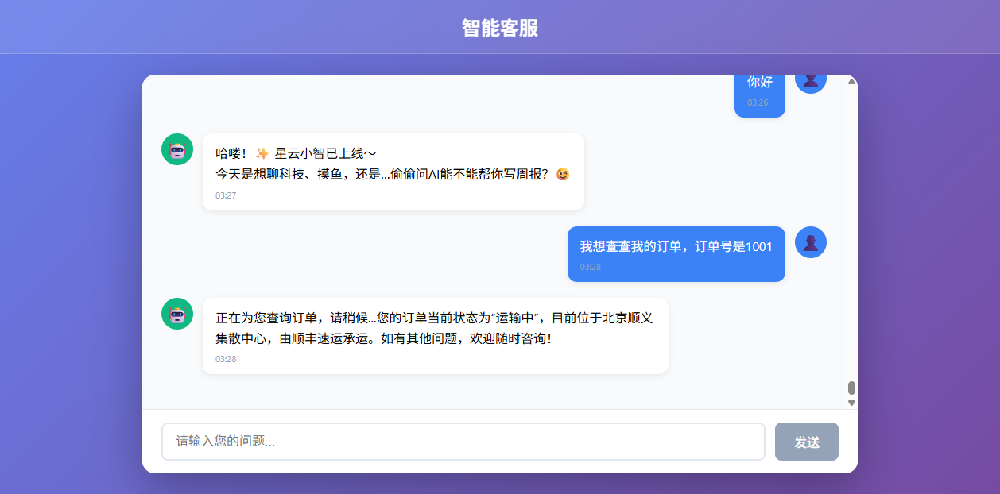
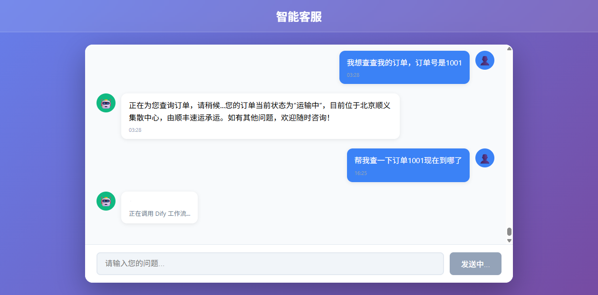
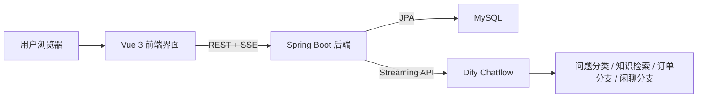
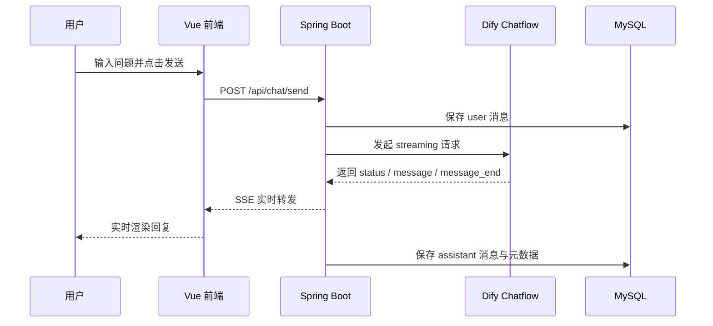

# Intelligent Customer Service System

> 一个面向电商客服场景的全栈智能客服系统，基于 Dify Chatflow、Spring Boot、Vue 3 和 MySQL 实现，支持知识问答、订单查询、多轮会话、历史记录与 SSE 流式回复。

<p align="center">
  
  
  
  
  
  
</p>

## 项目简介

传统电商客服往往面临人工成本高、响应速度不稳定、业务标准不统一等问题，而普通问答机器人又很难兼顾业务知识、上下文记忆和真实交互体验。本项目的目标，就是构建一套可落地、可扩展、可复现的智能客服系统，让大模型真正进入业务流程，而不仅仅停留在“能回答问题”的阶段。

该系统将 Dify Chatflow 作为大模型工作流引擎，通过问题分类器、知识检索、订单分支和闲聊分支处理不同场景；后端负责会话管理、消息落库、SSE 流式转发和 Dify 会话映射；前端负责聊天交互、实时渲染和历史消息展示。整体已经完成从“用户发送消息”到“工作流生成回复”再到“前端流式显示并持久化保存”的完整闭环。

## 页面效果

### 1. 聊天首页



### 2. 流式处理中

用户发送订单查询请求后，前端会先显示工作流状态与前置提示，而不是长时间无反馈。



### 3. 流式回复完成

订单查询分支会先输出状态提示，再返回业务回答，形成可感知的渐进式交互体验。


## 核心功能

- 基于 Dify Chatflow 的多分支智能客服工作流
- 支持售前咨询、售后支持、订单查询和闲聊场景
- 支持本地历史会话与消息记录持久化
- 支持本地会话 ID 与 Dify `conversation_id` 映射
- 支持后端 SSE 流式转发与前端实时渲染
- 支持 Docker Compose 一键启动前端、后端和数据库

## 系统架构



## 核心流程



## 技术亮点

### 1. 真正的 SSE 流式链路

项目不是等待 Dify 完整生成后一次性返回，而是：

- 后端以 HTTP/1.1 方式调用 Dify 流式接口
- 逐行解析 `event:` 和 `data:` 事件
- 使用 `SseEmitter` 将消息分片实时推送给前端
- 前端按块拼接 assistant 消息并实时更新页面

### 2. 稳定的多轮会话管理

系统维护两套会话标识：

- 本地数据库会话 ID：用于前端、历史记录和业务查询
- Dify `conversation_id`：用于保持大模型工作流上下文连续

这样既保留了业务系统对会话的控制权，也保证了 Dify 侧上下文连续。

### 3. 工作流层面的流式优化

为了实现真正的渐进式输出，项目采用“各业务分支直接 `Answer`”而不是“变量聚合后统一回复”的设计：

- 每个业务分支各自输出自己的回答
- 在耗时链路前增加前置状态 `Answer`
- 避免末端统一聚合导致的“假流式”

## 项目结构

```text
customer-service-system/
├─ backend/                  # Spring Boot 后端
│  ├─ src/main/java/...      # controller / service / entity / repository
│  ├─ src/main/resources/    # application.yml
│  └─ src/test/java/...      # 单元测试
├─ frontend/                 # Vue 3 前端
│  ├─ src/components/        # 聊天界面组件
│  ├─ src/services/          # API 和 SSE 解析
│  ├─ nginx.conf             # 生产代理配置
│  └─ Dockerfile
├─ docs/
│  ├─ assets/                # README 展示截图
│  ├─ workflows/             # Dify 工作流导出文件
│  └─ reproducibility.md     # 复现说明
├─ docker-compose.yml
├─ .env.example
└─ README.md
```

## 快速启动

### 1. 配置环境变量

复制环境变量模板：

```powershell
Copy-Item .env.example .env
```

编辑 `.env`：

```env
DIFY_API_KEY=app-your-dify-app-key
MYSQL_PASSWORD=your_mysql_password
BACKEND_HOST_PORT=8400
DIFY_API_BASE_URL=https://api.dify.ai/v1
APP_CORS_ALLOWED_ORIGINS=http://localhost,http://127.0.0.1,http://localhost:5173,http://127.0.0.1:5173
```

### 2. Docker 一键启动

```powershell
docker compose up -d --build
```

### 3. 访问服务

- 前端首页：`http://localhost`
- 后端健康检查：`http://localhost:8400/api/chat/health`
- 前端代理健康检查：`http://localhost/api/chat/health`

## Dify 工作流与复现资料

仓库中已整理出完整的 Dify 工作流文件和导入说明，便于你直接复现或做作品集展示：

- [工作流说明](./docs/workflows/README.md)
- [项目复现指南](./docs/reproducibility.md)
- [原始工作流导出](./docs/workflows/电商全能客服.yml)
- [流式优化版工作流导出](./docs/workflows/电商全能客服-流式优化版.yml)

## API 概览

| 接口 | 方法 | 说明 |
| --- | --- | --- |
| `/api/chat/send` | `POST` | 发送消息并通过 SSE 获取流式回复 |
| `/api/chat/new` | `POST` | 创建新会话 |
| `/api/chat/conversations` | `GET` | 查询会话列表 |
| `/api/chat/history/{conversationId}` | `GET` | 查询历史消息 |
| `/api/chat/health` | `GET` | 健康检查 |

## 已验证结果

当前版本已经验证通过：

- Docker Compose 可完整拉起前端、后端和 MySQL
- 前后端健康检查正常
- 创建会话、发送消息、查询历史记录链路正常
- Dify 工作流回复能实时回传到前端
- 订单查询分支能够显示前置状态并返回业务结果
- 后端 `mvn test` 通过
- 前端 `npm run build` 通过

## 适合展示的项目卖点

如果你打算把这个项目写进简历或作品集，可以重点强调：

- 这是一个真正联通大模型工作流、前后端界面和数据库持久化的完整系统
- 不是简单调用大模型 API，而是做了会话上下文、工作流编排和流式交互体验
- 解决了 SSE 流式解析、Dify 会话 ID 映射、工作流“假流式”等真实工程问题
- 具备后续继续扩展历史会话、用户反馈评测和长期记忆能力的基础

## 后续迭代方向

- 历史会话侧边栏
- 消息反馈按钮（有帮助 / 没帮助）
- 会话摘要与长期记忆
- 用户画像与偏好提取
- 客服质量评测与统计报表

---

如果你想直接运行本项目，建议先阅读 [项目复现指南](./docs/reproducibility.md)；如果你想先复现 Dify 工作流，建议直接查看 [工作流说明](./docs/workflows/README.md)。
