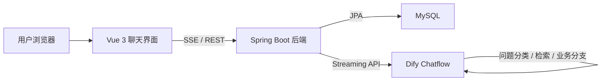

# Intelligent Customer Service System

一个面向电商客服场景的智能问答系统，支持售前咨询、售后支持、订单查询和闲聊陪伴等多种对话分支。项目基于 Dify Chatflow 作为大模型工作流引擎，结合 Vue 3 前端、Spring Boot 后端和 MySQL 数据持久化，提供从聊天交互、历史会话、消息落库到流式响应转发的完整闭环。

## 1. 项目背景

传统电商客服通常面临以下问题：

- 人工客服成本高，峰值时段压力大
- 响应速度不稳定，服务质量依赖个人经验
- 售前、售后、订单、闲聊等多种场景难以统一处理
- 普通问答机器人缺少业务知识、上下文记忆和真实流式体验

本项目的目标，是构建一套可实际部署、可持续扩展的智能客服系统，使大模型不仅“能回答”，还能够接入业务工作流、结合知识库和订单逻辑，并以更接近真实客服的形式持续输出结果。

## 2. 核心能力

- 基于 Dify Chatflow 的业务分支编排
- 多轮对话会话管理
- 本地会话 ID 与 Dify `conversation_id` 映射
- SSE 流式回复转发与前端实时渲染
- 会话历史和消息记录持久化
- Docker Compose 一键部署前端、后端和数据库

## 3. 技术栈

| 层级 | 技术 |
| --- | --- |
| 前端 | Vue 3、Vite、Axios |
| 后端 | Spring Boot 3.2、Spring Web、Spring Data JPA |
| 数据库 | MySQL 8.0 |
| AI 工作流 | Dify Chatflow |
| 部署 | Docker Compose、Nginx |
| 测试 | JUnit 5、Mockito |

## 4. 系统架构



### 请求链路

1. 用户在前端输入消息
2. 前端调用 `/api/chat/send`
3. 后端保存用户消息，并向 Dify 发送流式请求
4. Dify 返回 SSE 事件流
5. 后端逐行解析并转发给前端
6. 前端实时拼接消息内容并渲染
7. 后端在回复结束后落库 assistant 消息和引用信息

## 5. 项目亮点

### 5.1 真正的流式响应链路

项目不是简单等待大模型返回整段文本，而是：

- 后端使用 Java `HttpClient` 以 HTTP/1.1 调用 Dify 流式接口
- 逐行解析 `event:` / `data:` 事件
- 通过 Spring `SseEmitter` 将消息分片实时转发给前端
- 前端按块更新 assistant 消息，而不是一次性整段替换

### 5.2 多轮会话上下文稳定

系统同时维护两套会话标识：

- 本地数据库会话 ID：用于前端和历史记录查询
- Dify `conversation_id`：用于保持大模型上下文连续

这样既能支持本地历史会话管理，又能确保 Dify 工作流拥有连续上下文。

### 5.3 Dify 工作流适配

项目已适配“多 `Answer` 节点直接输出”的 Chatflow 结构，而不是末端变量聚合后统一回复，因此更容易实现真正的渐进式输出。

## 6. 目录结构

```text
customer-service-system/
├─ backend/                  # Spring Boot 后端
│  ├─ src/main/java/...      # 控制器、服务、实体、仓库
│  ├─ src/main/resources/    # application.yml
│  └─ Dockerfile
├─ frontend/                 # Vue 3 前端
│  ├─ src/components/        # 聊天组件
│  ├─ src/services/          # API 与 SSE 处理
│  ├─ nginx.conf             # 生产环境代理配置
│  └─ Dockerfile
├─ docker-compose.yml        # 一键部署配置
├─ .env.example              # 环境变量示例
└─ README.md
```

## 7. 快速开始

### 7.1 环境要求

- JDK 17
- Node.js 18+
- npm 9+
- Docker Desktop
- Maven 3.9+
- 可用的 Dify App API Key

### 7.2 配置环境变量

在项目根目录复制并编辑环境变量文件：

```powershell
Copy-Item .env.example .env
```

`.env` 示例：

```env
DIFY_API_KEY=app-your-dify-app-key
MYSQL_PASSWORD=your_mysql_password
BACKEND_HOST_PORT=8400
DIFY_API_BASE_URL=https://api.dify.ai/v1
APP_CORS_ALLOWED_ORIGINS=http://localhost,http://127.0.0.1,http://localhost:5173,http://127.0.0.1:5173
```

其中：

- `DIFY_API_KEY` 为必填
- `MYSQL_PASSWORD` 用于 Docker 中的 MySQL root 密码
- `BACKEND_HOST_PORT` 默认为 `8400`

### 7.3 Docker 一键启动

在项目根目录执行：

```powershell
docker compose up -d --build
```

启动后访问：

- 前端首页：`http://localhost`
- 后端健康检查：`http://localhost:8400/api/chat/health`
- 前端代理健康检查：`http://localhost/api/chat/health`

### 7.4 本地开发模式

#### 启动后端

```powershell
cd backend
mvn spring-boot:run
```

后端默认端口：

- 本地开发：`8080`
- Docker 暴露：`8400`

#### 启动前端

```powershell
cd frontend
npm install
npm run dev
```

前端本地开发地址：

- `http://localhost:5173`

## 8. Dify 工作流要求

为了获得更好的流式表现，建议 Dify 使用：

- `advanced-chat` 模式的 Chatflow
- 问题分类器区分售前、售后、订单、闲聊等分支
- 耗时分支前增加前置 `Answer` 提示
- 各业务分支直接连接自己的 `Answer` 节点
- 避免“变量聚合器 + 最终统一 Answer”这种会削弱流式效果的结构

如果你的订单分支使用了 `Code` 节点，还需要确保 Dify Sandbox 服务正常；如果是 Dify Cloud 环境出现沙箱证书异常，可以临时改为“LLM 模拟查单”分支。

## 9. API 说明

| 接口 | 方法 | 说明 |
| --- | --- | --- |
| `/api/chat/send` | `POST` | 发送消息并通过 SSE 接收流式回复 |
| `/api/chat/new` | `POST` | 创建本地新会话 |
| `/api/chat/conversations` | `GET` | 获取用户会话列表 |
| `/api/chat/history/{conversationId}` | `GET` | 获取指定会话的历史消息 |
| `/api/chat/health` | `GET` | 健康检查 |

### 发送消息请求示例

```json
{
  "query": "帮我查一下订单1001现在到哪了",
  "conversationId": "",
  "userId": "default-user",
  "files": []
}
```

### SSE 事件示例

```text
event: status
data: {"type":"status","message":"正在调用 Dify 工作流...","status":"processing"}

event: message
data: {"type":"message","content":"正在为您查询订单，请稍候..."}

event: message
data: {"type":"message","content":"您的订单当前状态为“运输中”..."}

event: message_end
data: {"type":"end","conversationId":"10","difyConversationId":"...","answer":"..."}
```

## 10. 数据模型

### `conversations`

用于保存会话信息：

- 本地会话 ID
- 用户标识
- 会话标题
- Dify 会话 ID
- 创建时间 / 更新时间

### `messages`

用于保存每轮消息：

- 消息 ID
- 所属会话 ID
- 角色（`user` / `assistant`）
- 消息正文
- 元数据（如引用信息）
- 创建时间

## 11. 已验证能力

当前版本已验证通过的链路包括：

- Docker Compose 拉起前后端与 MySQL
- 新建会话
- 查询历史会话与历史消息
- 用户消息发送到 Dify
- Dify 工作流回复回传到前端
- SSE 状态事件与消息分片渲染
- assistant 回复与引用信息落库
- 本地会话 ID 与 Dify 会话 ID 同步

## 12. 测试方式

### 后端测试

```powershell
cd backend
mvn test
```

已包含的单元测试覆盖：

- 会话 ID 同步
- 旧 Dify 会话 ID 失效后的重试逻辑
- 历史消息引用信息解析
- 流式消息分片发送

### 前端构建验证

```powershell
cd frontend
npm install
npm run build
```

## 13. 常见问题

### 13.1 页面可以打开，但发送消息没有回复

优先检查：

- `.env` 中 `DIFY_API_KEY` 是否正确
- Dify 工作流是否可直接在平台中运行
- Docker 容器是否正常启动

### 13.2 看起来还是一次性输出

排查顺序：

1. 查看后端是否已经逐块收到 Dify 的 `message` 事件
2. 如果后端已经逐块收到，而前端仍一次性显示，检查前端 SSE 解析逻辑
3. 如果 Dify 本身只在最后返回一条完整 `message`，则需要优化 Chatflow 结构，而不是继续修改项目代码

### 13.3 订单查询分支报 `Code` 节点异常

通常是 Dify Sandbox 服务问题，而不是本项目后端问题。建议：

- 检查 Dify Sandbox 是否可用
- 检查自建环境证书和反向代理
- 必要时将订单分支改为 LLM 模拟查单

## 14. 后续优化方向

- 历史会话侧边栏
- 会话标题自动摘要
- 消息反馈按钮（有帮助 / 没帮助）
- 会话质量评测与报表
- 用户长期记忆与偏好抽取
- 多租户与鉴权能力

## 15. 开源与安全说明

- 本仓库不会提交真实的 `.env` 文件
- 请使用 `.env.example` 作为配置模板
- 推送代码前请再次确认未提交 API Key、数据库密码或测试凭据

如果你准备将本项目用于课程设计、毕业设计或作品集展示，建议同时附上 Dify 工作流导出文件和运行截图，以便完整展示系统能力。
